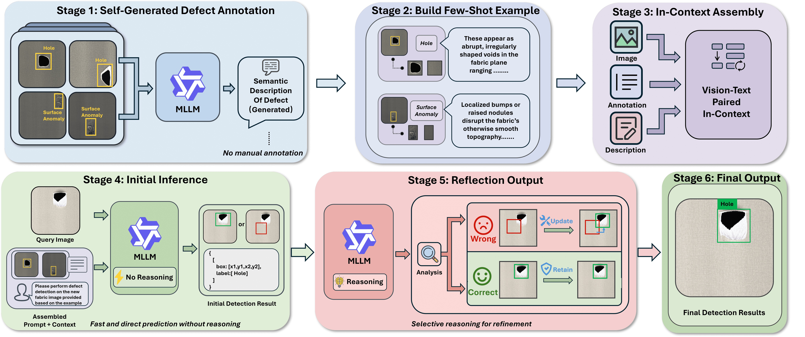

# Fabric Defect Few-Shot Demo

[中文](./README_CN.md)

This is a minimal paper-oriented repository with only 4 core stages:

1. Use `train` annotations as few-shot context only (no model training).
2. Visualize bbox annotations on sample images and save them.
3. Send two visualized samples per class to the model, generate class descriptions, and save learning context for detection.
4. Load the learning context and run "direct detection (no-thinking) + reflection review (thinking model)" on test images.

## Method Figure



## Repository Structure

```text
VTP-ICL/
├─ data/
│  ├─ train_example.json                 # Public anonymized annotation schema example
│  └─ test_example.json                  # Test set example
├─ scripts/
│  ├─ visualize_train_annotations.py     # Step 1: visualization and save
│  ├─ build_icl_context.py               # Step 2: description generation + context building
│  └─ run_detection_with_reflection.py   # Step 3: detection + reflection review
├─ outputs/
│  └─ vis_train/                         # Output folder for visualized train samples
└─ requirements.txt
```

## 1) Annotation Schema Example

`data/train_example.json`

- `image`: relative image path
- `conversations[0].value`: empty (unused in this experiment)
- `conversations[1].value`: annotation string, format:
  `[{\"bbox_2d\": [x1,y1,x2,y2], \"label\": \"class name\"}]`

## 2) Environment Setup

Recommended Python version: `3.11`

```bash
conda create -n VTP_ICL python=3.11 -y
conda activate VTP_ICL
pip install -r requirements.txt
```

Set API key:

```bash
set DASHSCOPE_API_KEY=your_key
```

## 3) Run Pipeline

### Step A: Visualize train annotations and save

```bash
python scripts/visualize_train_annotations.py ^
  --train-json data/train_example.json ^
  --image-root . ^
  --output-dir outputs/vis_train ^
  --manifest-out outputs/vis_manifest.json
```

This produces `outputs/vis_manifest.json`, which records each visualized image and its annotation text.

### Step B: Generate class descriptions + build ICL learning context

```bash
python scripts/build_icl_context.py ^
  --manifest-json outputs/vis_manifest.json ^
  --output-json outputs/icl_context.json
```

The per-class context structure is:
- image 1
- text 1 (bbox + label of image 1)
- image 2
- text 2 (bbox + label of image 2)
- text 3 (model-generated class description)

### Step C: Detection and reflection review

```bash
python scripts/run_detection_with_reflection.py ^
  --context-json outputs/icl_context.json ^
  --test-json data/test_example.json ^
  --output-json outputs/detection_results.json
```

## Notes

- This repository is a method-structure demo for paper reproduction and does not expose private data.
